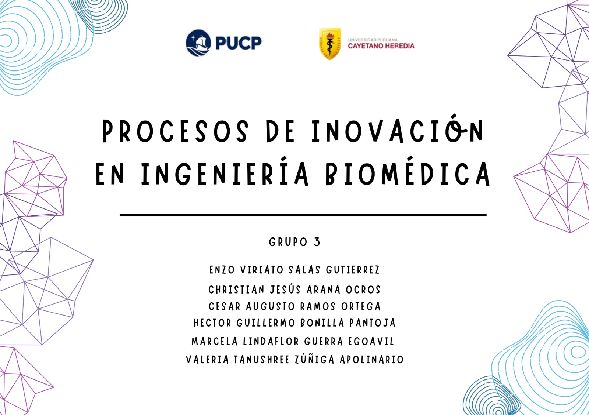
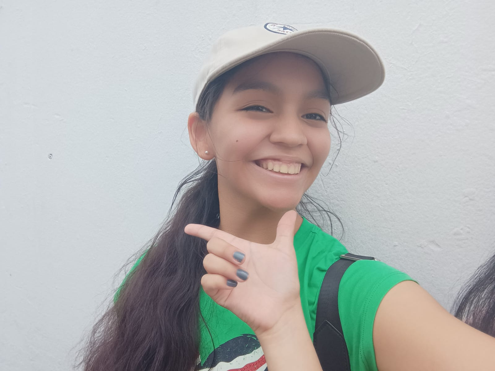
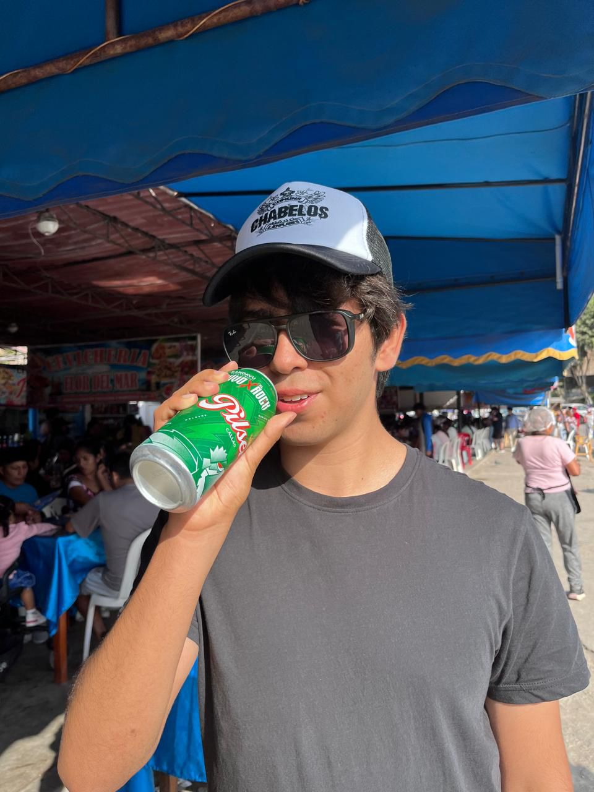
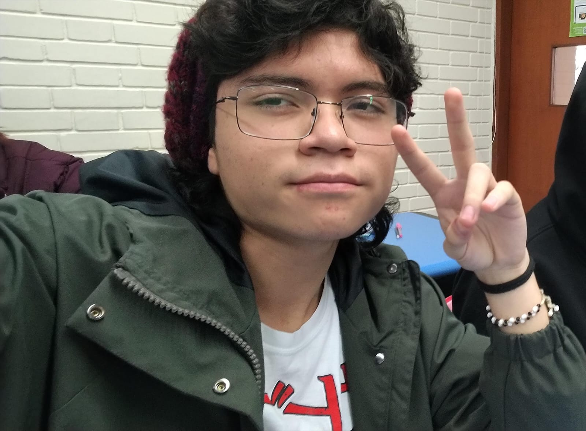
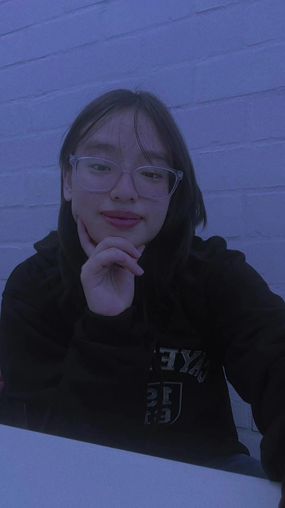
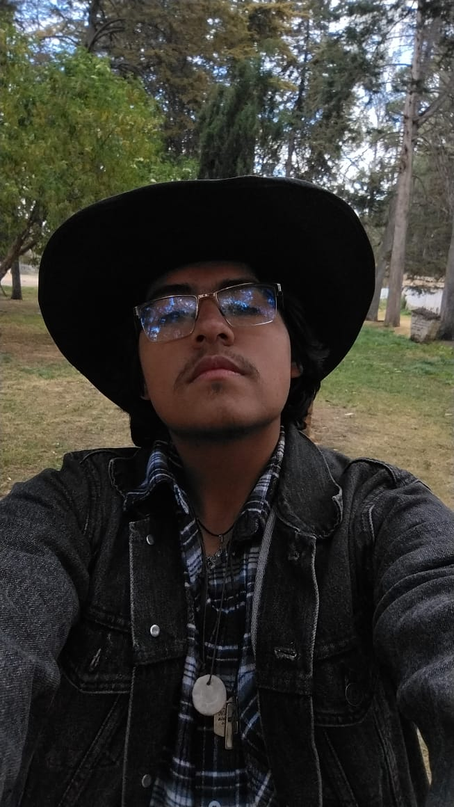

# GRUPO 3

# DESCRIPCIÓN DEL GRUPO
Somos estudiantes de la carrera de Ingeniería Biomédica PUCP-UPCH del horario PIB04 en el curso "Procesos de Innovación de Bioingeniería". Estamos comprometidos con completar todos los objetivos del curso de manera optima con el fin de formar la capacidad de enfrentarnos a retos con relación a la biomédica a través del desarrollo del proyecto

# **INTEGRANTES DEL GRUPO**

# DESCRIPCIÓN DE MIEMBRS DEL GRUPO

**1.) Marcela Lindaflor Guerra Egoavil**

**EDAD:** 17 años

**PASATIEMPO:** Leer

**ROL:** Cordinadora de grupo / lider de comunicacion

**2.) Christian Jesús Arana Ocros**

**EDAD:** 17 años

**PASATIEMPO:** Tocar piano

**ROL:** logistica

**3.) Enzo Viriato Salas Gutierrez**

**EDAD:** 17 años

**PASATIEMPO:** Cocinar

**ROL:** Control de calidad

**4.) Valeria Tanushree Zúñiga Apolinario**

**EDAD:** 18 años

**PASATIEMPO:** Dibujar

**ROL:** Diseñar

**5.) Hector Guillermo Bonilla Pantoja**

**EDAD:** 17 años

**PASATIEMPO:** Deportes de contacto

**ROL:** Programar

**6.) Cesar Augusto Ramos Ortega**

**EDAD:** 19 años

**PASATIEMPO:** Leer

**ROL:** Gestor de materiales

